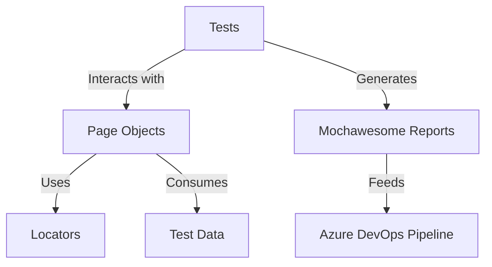

## UI Testing Framework for Quinshift ##

## Getting started
Make sure you have proper version (v20.18.2) of NodeJS environment set up.
- Clone the project to your machine
- Install Cypress with `npm install cypress --save-dev`

## Tests Execution
There are 3 ways to run tests:
1. `npx cypress open` which will open Cypress runner where you can select spec files to run
2. `npx cypress run --spec cypress\e2e\*.cy.js` which will run all tests in a command line (headless)
3. Create new pipeline in Azure Devops using azure-pipelines.yml and run it

## What's where?
- e2e/ - location of spec file
- e2e/pages/ - location of page class files with locators and functions
- fixtures/ - location of credentials and user data files
- support/loginHelper - method for login handling
- support/merge-reports.js - method for reports merge handling

## Framework Architecture



**Key Relationships**:
1. **Tests → Page Objects**:  
   - Tests only call methods like `homePage.login()` (no direct selectors)  
   - *Benefit*: Tests stay clean and readable

2. **Page Objects → Locators/Data**:  
   - Centralized selectors (e.g., `[data-test="username"]`)  
   - Test data loaded from `fixtures/`  
   - *Benefit*: Changes only made in one place

3. **Reports → Pipeline**:  
   - Mochawesome provides HTML/visual failure analysis  
   - Azure DevOps tracks historical trends  

**Example Flow**:  
```
1. `login.cy.js` (Test) → Uses `homePage.login()`  
2. `homePage.js` → Uses `[data-test="username"]` (Locator) + `credentials.json` (Test Data)  
3. On failure → Mochawesome highlights DOM snapshots → Azure DevOps alerts team
```
